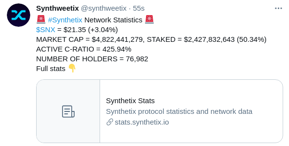

# Synthweetix - Twitter Bot for Synthetix Statistics

This project is a submission to the [Open DeFi Hackathon](https://gitcoin.co/issue/snxgrants/open-defi-hackathon/5/100025663#).

## Challenge description

Build a Twitter Bot that tracks and reports on interesting Synthetix Stats:

Exchange Volume
- Trading Fees
- Total Value Locked
- Amount of SNX staked (% of total)

Note: Reference the [Synthetix Stats](https://stats.synthetix.io/) page for more options/information.

## Solution

### Data collection

Concerning data collection, I have opted not to scrape various APIs or the HTML pages.
Instead I have contributed to the Synthetix Stats project and extended it with an API endpoint that exposes all the required statistics as a JSON payload.
By doing this, the statistics can easily be consumed by not only this bot, but any future application that requires up-to-date statistics about Synthetix.

More information on the changes can be found here at [https://github.com/pimoens/synthetixio-stats/tree/nextjs-api](https://github.com/pimoens/synthetixio-stats/tree/nextjs-api).

### Twitter bot

I have opted to create a simple, well-structured Python solution using [tweepy](https://www.tweepy.org/). 
The bot is up and running at [https://twitter.com/synthweetix](https://twitter.com/synthweetix).

4 types of statistics (as per Synthetix Stats) are included:
- **Network statistics**
  - Price of SNX in USD (Change over the last 24h)
  - Market cap in USD
  - Amount of SNX locked/staked (Percentage)
  - Active C-Ratio
  - Number of holders
- **Staking statistics**
  - SNX Staking APY
  - SNX Staking APY (With rewards)
  - Rewards pool
  - Unclaimed fees and rewards
  - Upcoming fees in next period
  - Number of stakers
- **Trading statistics**
  - Trading volume
  - Trading fees
  - 24h exchange volume
  - Number of trades
  - Number of unique traders
  - Average daily traders
- **Yield Farming statistics**
  - Lending APY
  - Weekly rewards and APY for sUSD, sETH and sBTC
  
Each type of statistics is communicated by a single tweet every day at 13:00 UTC (easily configurable).

**Preview**




## Deployment

### Configuration

#### Environment variables

| Name                      | Description                                                     | Default                                     |
| :-------------:           | :-------------:                                                 | :-----:                                      |
| CONFIGURATION             | Configuration to run (`development`, `production` or `cronjob`) | `development`                               |
| TWITTER_CONSUMER_KEY      | Twitter Consumer Key                                            | `''`                                        |
| TWITTER_CONSUMER_SECRET   | Twitter Consumer Secret                                         | `''`                                        |
| TWITTER_ACCESS_TOKEN      | Twitter OAuth Access Token                                      | `''`                                        |
| TWITTER_ACCESS_SECRET     | Twitter OAuth Access Secret                                     | `''`                                        |
| SYNTHETIX_STATS_ENDPOINT  | API Endpoint of the Synthetix Stats application                 | `https://synthetix-stats.herokuapp.com/api` |

### Heroku

Application is deployed on [Heroku](https://heroku.com) using a CronJob

```
clock: python main.py
```

**Note:** Scale up the process when deploying for the first time using the Heroki CLI

```
heroku ps:scale clock=1
```

### Docker

Dockerfile has been included for deployment using Docker